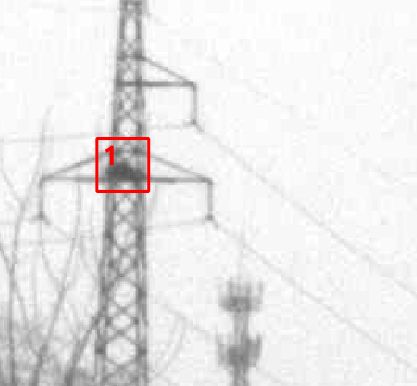
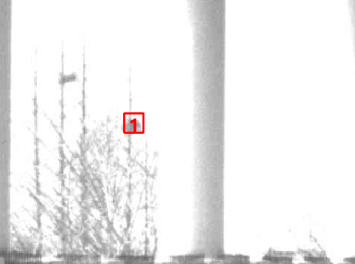

# 误检目标

## 房子的窗户

as bird‘s nest

1 time

## 路灯

as bird‘s nest

3 times
the same target

## 红绿灯

as bird

26 times
the same target

## 房顶

as bird‘s nest

7 times
the same target

## 电线杆

as bird‘s nest

7 times
the same target

## 变电箱把手

as bird‘s nest

2 times
the same target

## 连接器

as bird‘s nest

5 times
the same target

## 站牌背部

as bird‘s nest

3 times
the same target

## 路灯

as bird‘s nest

38 times
the different target on the same road

# 疑似目标

## 电线杆上的鸟窝

## 电线上的鸟

## 附近树上的鸟窝

## 车站里的鸟窝

# 漏检

## 354 & 356

# 展示

## 1 选择要预测的数据集

## 2 发送预测，处理进度条

## 3 预测结果展示

### 3.1 单张图片预测结果展示

### 3.2 正确率统计

AP mAP

根据检测结果选择复检数据

## 4 导出检测结果